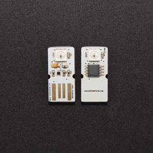

 |  |  | 

  <b><a href="#overview">Overview</a></b>
  |
  <b><a href="#features">Features</a></b>
  |
  <b><a href="#installation">Installation</a></b>

 

### Overview

### Features

### Installation
- [Yarn Package Manager](https://yarnpkg.com/lang/en/docs/install/#windows-tab)
- [Node.js > 6.0](https://nodejs.org/en/)

<a href="#top">:arrow_up:</a>

